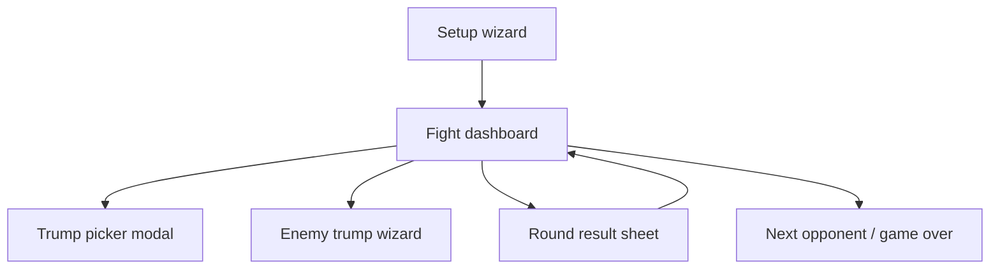

# Public GUI v1 — design spec (Issue #4)

**Context:** [@DaviJh](https://github.com/DaviJh) thanked the tool and asked for a GUI — mainly because **picking trump cards in the terminal takes too long** during live play.

**Goal for the fun public build:** a **second-screen companion** (phone, tablet, or laptop beside the game) that keeps all solver logic but replaces typing with taps. No RNG seed tracing, no REFramework requirement — same stance as the current README.

---

## Product principles

1. **Play-first** — one thumb can update state between turns; no nested menus mid-fight.
2. **Trump picker is the hero** — grid of cards with icons/names; tap to add/remove; locked cards grayed out.
3. **Advice, not autopilot** — show odds + one clear recommendation; player still plays the game.
4. **Horror companion tone** — dark clinical UI (RE7 basement / VHS), not a casino app.
5. **Keep the brain in Python** — GUI is a thin client over existing functions (`analyze_round`, `generate_advice`, `handle_interrupt` logic, etc.).

---

## Recommended stack

| Option | Pros | Cons | Verdict |
|--------|------|------|---------|
| **Local web app** (FastAPI/Flask + static HTML/JS) | Runs on `localhost:8765`; phone on same Wi‑Fi; big buttons; easy trump grid | Needs browser tab open | **Best for v1** |
| Desktop (PyQt / Tkinter) | Single `.exe` possible | Harder pretty UI; awkward on phone | v2 packaging |
| TUI upgrade (Textual) | Still keyboard-heavy | Doesn't fix DaviJh's ask | Skip for public |

**v1 delivery:** `python3 -m re7_gui` → opens browser → single-page fight view.

**Dependencies (public):** one lightweight web stack only (e.g. `fastapi` + `uvicorn`); core solver stays stdlib-compatible for CLI users.

---

## Screen map



### 1. Setup wizard (once per session)

- Mode: Normal / Survival / Survival+
- Challenge checkboxes (replace `setup_challenge_progress` numbered list)
- Starting trump hand → **opens trump picker immediately**
- Optional: import `~/.re7_21_progress.json`

### 2. Fight dashboard (80% of play time)

Single scroll-free layout on  landscape phone or narrow window:

```
┌─────────────────────────────────────────┐
│  YOU ████████░░ 7/10    OPP ████░░░░ 4/10 │
│  Molded Hoffman · Round 2 · Target 21     │
│  Bet 3 vs 2                               │
├─────────────────────────────────────────┤
│  YOUR TABLE          │  OPP TABLE         │
│  [?] + 4 + 9 = ?     │  7 + 3 = 10        │
│  (tap ? to set down) │  (tap + to add)    │
├─────────────────────────────────────────┤
│  DECK 1–11  IN/OUT grid (tap = dead)     │
├─────────────────────────────────────────┤
│  SAFE 62% · BUST 38% · STAY wins ~54%    │
│  ⚡ Curse risk HIGH — keep Destroy ready   │
├─────────────────────────────────────────┤
│ [+Draw] [Opp draw] [Stay] [Enemy trump]  │
│ [Play trump] [End round] [Trumps ▼]      │
└─────────────────────────────────────────┘
```

**Always visible:** HP, target, bet, deck matrix, top advice line.

**No letter keys** — every CLI action (`H/O/S/I/P/D/W`) is a labeled button.

### 3. Trump picker modal (Issue #4 fix)

Replace `edit_trump_hand()` numbered list with:

- **Your hand** — horizontal scroll of chips; tap × to remove; drag to reorder optional.
- **Add panel** — categorized tabs matching `TRUMPS` categories:
  - Bet · Defense · Cards · Counter · Special
- Each card: **name + 1-line desc + tap to toggle**
- 🔒 Locked unlockables shown but disabled (from `available_trumps`)
- **Quick actions:**
  - "Duplicate last fight hand"
  - "Clear all"
  - Search/filter (Survival+ has many trumps)

Target interaction: **add 3 trumps in under 5 seconds** without typing.

### 4. Number entry — 1–11 pad

Replace all `input(" Card (1-11)")` with a **fixed numpad**:

```
[1] [2] [3] [4] [5] [6]
[7] [8] [9] [10] [11] [⌫]
```

- Face-down card: one pad tap (shows as `?` on table)
- Draws: pad → auto-appends to correct side
- Dead cards: toggle on deck grid (red = out)

### 5. Enemy trump wizard (replaces `handle_interrupt`)

Step-through cards instead of numbered list + free text:

1. Grid of **opponent's known trumps** (from `intel.trumps` + `standard_trumps`)
2. Tap the card they played
3. **Effect-specific mini-forms** (only show relevant fields):
   - Curse → forced card pad
   - Desire → slider for trump count
   - Remove → tap your face-up card to kill
4. Summary toast + auto re-analyze

### 6. Round result sheet

Big three buttons: **Won · Lost · Tie/Void**

- Won/Lost → bet damage as **+ / − chips** (1–21), not raw typing
- Show HP delta animation
- Auto-advance to next round

---

## What ships in public v1 vs later

| In v1 (fun helper) | Not in v1 (research / power user) |
|--------------------|-----------------------------------|
| Fight dashboard + trump picker + numpad | RNG trace / seed tools |
| Deck matrix + stay/hit odds | Full Hoffman FSM debug view |
| Enemy trump wizard (top ~15 trumps) | CardGameBanker field dump |
| Gauntlet HP carry + fight #5/#10 warnings | CLI parity for every `?` submenu |
| Challenge unlock persistence | Free Play lab mode |
| Opponent variant picker (visual icons) | Lucas saw-round script automation |

---

## Architecture (when you build it)

```
re7_gui/
  server.py          # FastAPI routes: /state, /action, /analyze
  static/
    index.html
    app.js           # state + render
    style.css        # RE7-dark theme
re7_core/            # extracted from re7_helper_latest.py
  state.py           # RoundState dataclass
  analyze.py           # analyze_round, generate_advice
  trumps.py            # TRUMPS, apply_trump_effect
  opponents.py         # OPPONENTS_* 
```

- **Single `RoundState` object** in memory (or JSON file) — GUI and CLI share it.
- API shape: `POST /action {"type":"draw","side":"player","card":4}` → returns updated state + advice blob.
- Keeps monolith split aligned with research roadmap without blocking GUI work.

---

## Visual / “fun” polish (cheap wins)

- **Sack-head opponent icons** for variant selection (2-cut / 3-cut / wire count)
- **Finger / voltage HP** skins by mode (Survival vs Survival+)
- Subtle scanline or grain overlay; avoid readable horror gore — keep it stream-friendly
- Sound optional and off by default (card tap, round win)
- **Compact mode** for 6" phones — hide opponent AI debug lines

---

## Suggested reply for Issue #4

> Thanks for the feedback — glad it helped! A GUI is planned for a simpler public companion build. The main focus will be a **tap-based trump card picker** and **1–11 card pad** so you're not typing card numbers mid-fight. Goal is a second-screen web UI you open on a phone or laptop next to the game while keeping the same odds/advice engine underneath. Research features (RNG/deep AI) stay separate. No ETA yet, but your note on trump selection time is exactly what v1 will optimize for.

---

## Success metrics (when you test v1)

- Starting trump hand: **&lt; 10 s** for 5 cards (vs ~30+ s in CLI today)
- Mid-round draw update: **1 tap** (vs 2 prompts in CLI)
- Enemy Curse interrupt: **≤ 3 taps** (trump → forced card → done)
- User never needs to remember hotkeys `H/O/S/I/P/D/W/?`

---

## Next step when scoping implementation

1. Extract `RoundState` + `POST /analyze` wrapper (no UI yet) — proves split.
2. Build trump picker + numpad static mock in HTML (fake data).
3. Wire fight dashboard buttons to real `fight_opponent` logic.
4. Dogfood one Survival+ run on phone browser before polish pass.
